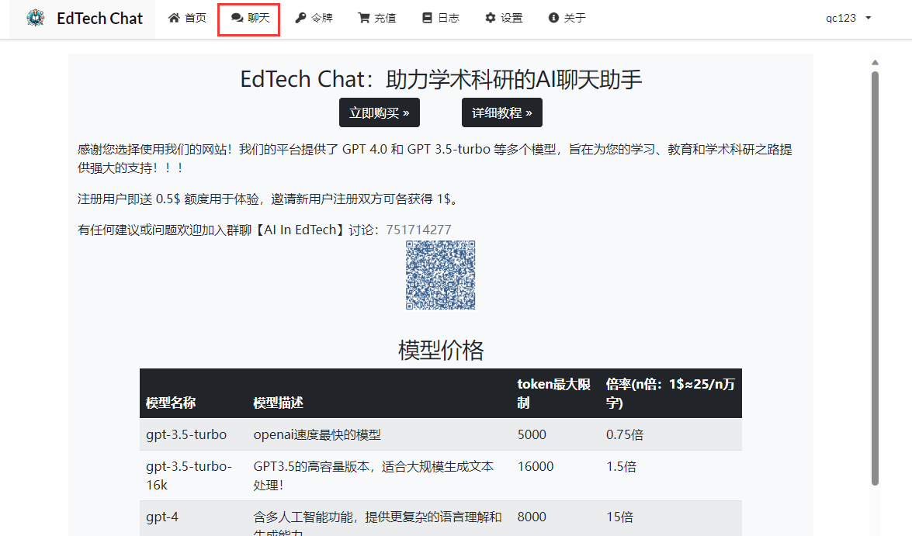

# EdTech Chat介绍

网站提供了 GPT 4.0 和 GPT 3.5-turbo 等多个模型，旨在为您的学习、教育和学术科研之路提供强大的支持！！！

注册用户即送 0.5$ 额度用于体验，邀请新用户注册双方可各获得 1$。

有任何建议或问题欢迎加入群聊【AI In EdTech】讨论：[751714277](http://qm.qq.com/cgi-bin/qm/qr?_wv=1027&k=J__EZ8p3i_h6h4llMSj87W8wILI0QIUC&authKey=koSz9UroMKLIrWnvKX8sZnzyC1S9EaM8dgrUmDMi8vlW9N37%2FqIEAAw8cEgJBwst&noverify=0&group_code=751714277)

PS：进群可领取免费50$共享额度key

推荐站长自营的导航网站：[EdTech导航](https://dash.gpt-eter.top/)，收录了很多辅助教学科研的实用工具，不定期更新！

# 对话聊天

1、注册账号，暂只支持QQ邮箱注册

2、到令牌页面添加令牌，设置有效期和额度

3、添加成功后，点击复制即可复制key，可用于第三方AI对话平台，如[lobechat](https://lobechat.gpt-eter.top)等，也可点击聊天直接开启聊天

4、点击聊天或者访问[lobechat](https://lobechat.gpt-eter.top)开启对话

PS：在第三方平台使用时, base url 一般为 https://api.gpt-eter.top 或 https://api.gpt-eter.top/v1 或 https://api.gpt-eter.top/v1/chat/completions，注意末尾不要打斜杠

# 充值兑换

1、前往[发卡网](https://dwz.cn/PJARMxgn)购买兑换码

2、获得兑换码后到充值页面使用兑换码进行兑换

